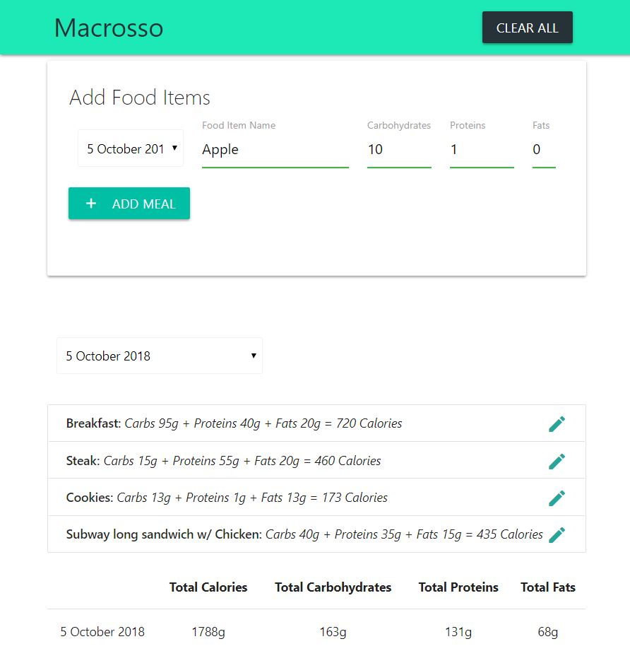
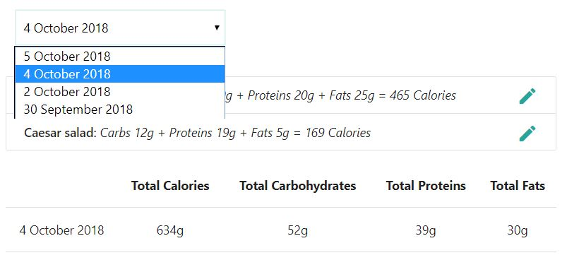
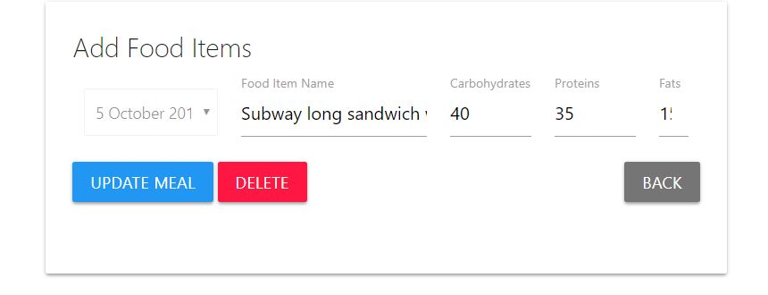

# Macrosso - [Try Demo](https://assainov.github.io/macrosso)
## Track your macronutrients and calories by meals and days
## Purpose: to practice **module pattern** in Vanilla JS.
### Technologies used: Javascript ES5 & ES6+, Local storage, Materialize CSS

#### Description: Having initially completed the app as a course project to track calories, I challenged myself to extend the functionality to track macros by days. In the app, you can add, edit and remove foods from the list. The main advantage is that you can filter your foods by days and see how many calories and macros you consumed in each day. You can add new items in the last 7 days, and you can see, edit and delete items in your diet history! Everything is stored in the local storage.

#### Make sure to try the app yourself!

## Screenshot:

